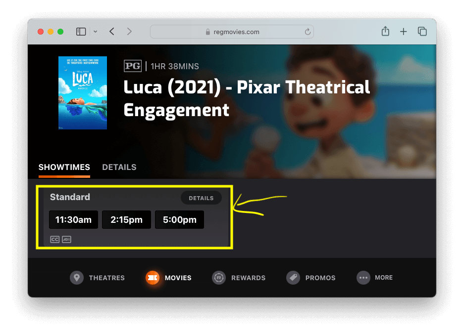
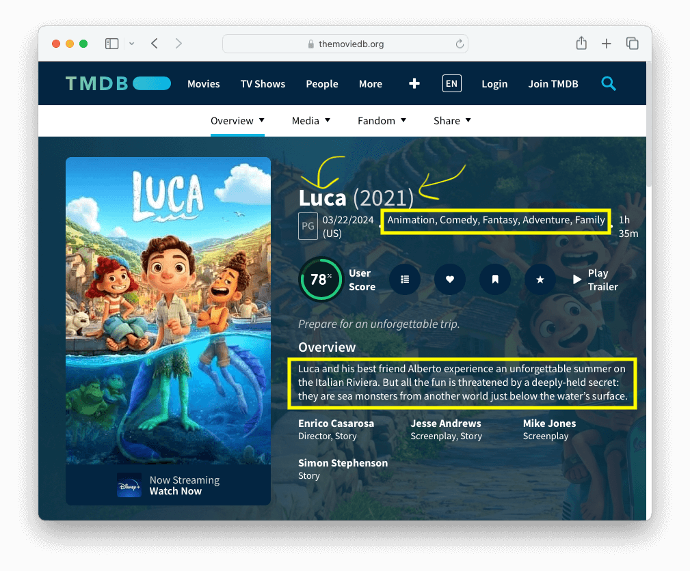
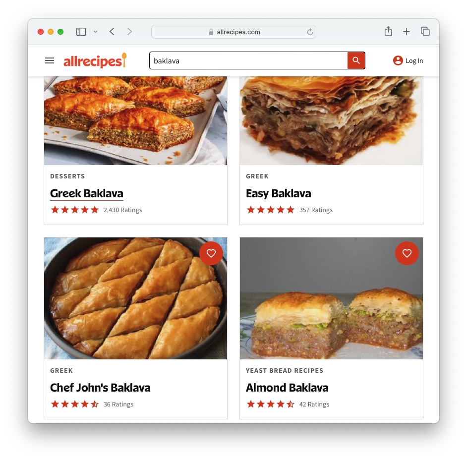
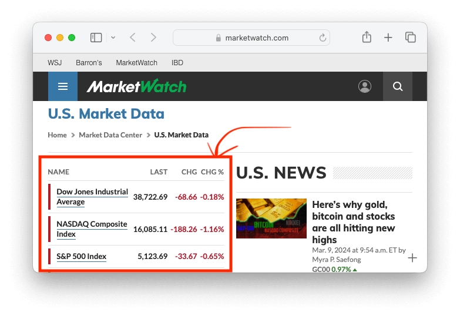
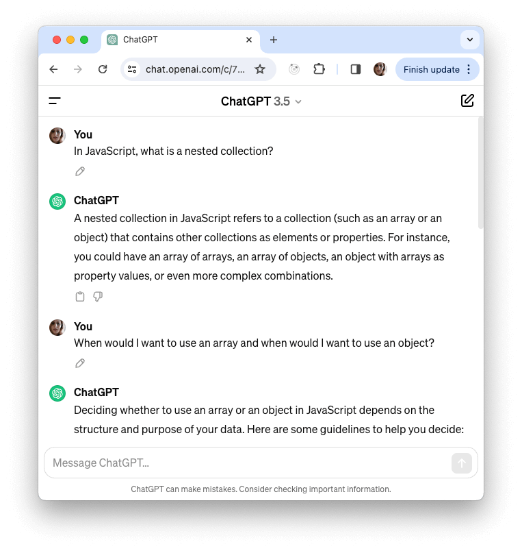

# Solutions to "Data Structures" Exercise

If you are viewing this in Visual Studio Code, press `command + shift + v` on Mac or `ctrl + shift + v` on Windows to open this in preview mode.

You can find the questions in Teams under "Assignments".

One thing to note about the questions to this assignment is that there isn't a single right answer. Keep this in mind as you review my answers to the problems.

## 1. Movie Show Times



> You are building a website for you local theatre and your working on a page for a single movie. (For example, the movie "Luca".) On this page, there is a list of times that the movie is playing in the movie theatre. The times are 11:30am, 2:15pm, and 5:00pm. Create a data structure that you think best represents a list of show times.

Here's my answer:

```js
const showTimes = ["11:30am", "2:15pm", "5:00pm"];
```

I am using an array because we don't have a need for key-value pairs and order is important here. Users expect us to display the showtimes from the earliest time in the day to the latest time in the day.

## 2. Movie Page



> Let's say you work for a new site that is a competitor to IMDB or Rotten Tomatoes. On the site, you are creating a page that displays information about a single movie. The movie has the following information:
>
> - A title, which is "Luca"
> - A year, which is 2021
> - Genres, which includes "Animation", "Comedy", "Fantasy", "Adventure", and "Family"
> - An overview / movie description, which is: "Luca and his best friend Alberto experience an unforgettable summer on the Italian Riviera. But all the fun is threatened by a deeply-held secret: they are sea monsters from another world just below the water’s surface."
>
> Create a data structure that you think best represents this movie.

Here's my answer:

```js
const movie = {
  title: "Luca",
  year: 2021,
  genres: ["Animation", "Comedy", "Fantasy", "Adventure", "Family"],
  description:
    "Luca and his best friend Alberto experience an unforgettable summer on the Italian Riviera. But all the fun is threatened by a deeply-held secret: they are sea monsters from another world just below the water’s surface.",
};
```

I am using an object because: a.) we are representing _one thing_ instead of a _list of things_ b.) the thing (the movie) has a list of characteristics that fit nicely within the key-value structure. I find that the key-value structure is much easier to read if I were to display the movie on the page. For example:

```js
let html = `<div>
  <h1>${movie.title}</h1>
  <p>${movie.year}</p>
  <!-- ... -->
</div>`;
```

The genres is an array because it is a list of things and it doesn't work within a key-value format.

## 3. Recipe Search Results



> Let's say you work for a recipes site like allrecipes.com. The site has a search engine, and you working on displaying the search results for "baklava". Here are the results:
>
> 1st Recipe
>
> - The name is "Greek Baklava"
> - The category is "Desserts"
> - It has an average of a 5 star rating
> - 2,430 people rated this recipe
>
> 2nd Recipe
>
> - The name is "Easy Baklava"
> - The category is "Greek"
> - It has an average of a 5 star rating
> - 357 people rated this recipe
>
> 3rd Recipe
>
> - The name is "Chef John's Baklava"
> - The category is "Greek"
> - It has an average rating of 4.5 stars
> - 36 people rated this recipe
>
> 4th Recipe
>
> - The name of this recipe is "Almond Baklava"
> - The category is "Yeast Bread Recipes"
> - It has an average rating of 4.5 stars
> - 42 rated this recipe
>
> Create a data structure that you think best represents the search results for baklava recipes.

Here's my answer:

```js
const recipes = [
  {
    name: "Greek Baklava",
    category: "Desserts",
    rating: 5,
    numberOfRatings: 2430,
  },
  {
    name: "Easy Baklava",
    category: "Greek",
    rating: 5,
    numberOfRatings: 357,
  },
  {
    name: "Chef John's Baklava",
    category: "Greek",
    rating: 4.5,
    numberOfRatings: 36,
  },
  {
    name: "Almond Baklava",
    category: "Yeast Bread Recipes",
    rating: 4.5,
    numberOfRatings: 42,
  },
];
```

My answer above is an array of objects, which is frequently used with search results.

Arrays are better when you have multiple versions of a thing (a receipe). Also, order matters here because we want the highest rating at the top. So for these reasons, I'm choosing an array to list all the recipes.

However, each recipe contains a lot of information that can't be represented by a single string, number, or other primitive data type. So now I must make a decision between an array or an object to represent a single recipe. I find multi-demsional hard to read and usually avoid them. Plus, I think that each receipe fits within the key-value format, so I'm representing each recipe as an object.

The array of objects pattern combines the strengths of an array with the strengths of an object.

## Stock Exchange Table



> You are working on a new sites. On one of the pages, the site displays the the US stock exchange listing in a table. Here is the listing for today:
>
> First row in table:
>
> - The name of the stock listing is "Dow Jones Industrial Average"
> - The "last", or price of the last trade, is $38,722.69
> - The change is -68.66
> - The percent of change is -0.18%
>
> Second row in a table:
>
> - The name of the stock listing is "NASDQA Composite Index"
> - The "last", or price of the last trade, is $16,085.11
> - The change is -188.26
> - The percent of change is -1.16%
>
> Third row in a table:
>
> - The name of the stock listing is "S&P 500 Index"
> - The "last", or price of the last trade, is $5,123.69
> - The change is -33.67
> - The percent of change is -0.65%
>
> Create a data structure that you think best represents a table, where each row is a listing within the US market stock exchange.

Here's my answer:

```js
const stockExchangeTable = [
  {
    name: "Dow Jones Industrial Average",
    last: 38722.69,
    change: -68.66,
    percentage: -0.18,
  },
  {
    name: "NASDQA Composite Index",
    last: 16085.11,
    change: -188.26,
    percentage: -1.16,
  },
  {
    name: "S&P 500 Index",
    last: 5123.69,
    change: -33.67,
    percentage: -0.65,
  },
];
```

I find that array of objects is the best fit for a table.

The reason I am using an array is because that order usually matters with a table.

For each row, I think that an object is normally a good fit. The table's column name fits as a _key_ and the data in the cell fits as a _value_.

## ChatGPT Conversation



You are working on the chat user interface for ChatGPT. The user is asking questions about nested collections, arrays, and objects in JavaScript. The conversation is as follows:

> Dialogue 1
>
> - The author is "You" (the user)
> - The question is "In JavaScript, what is a nested collection?"
>
> Dialogue 2
>
> - The author is "ChatGPT"
> - The answer is "A nested collection in JavaScript refers to a collection (such as an array or an object) that contains other collections as elements or properties. For instance, you could have an array of arrays, an array of objects, an object with arrays as property values, or even more complex combinations."
>
> Dialogue 3
>
> - The author is "You" (the user)
> - The question is "When would I want to use an array and when would I want to use an object?"
>
> Dialogue 4
>
> - The author is "ChatGPT"
> - The answer is "Deciding whether to use an array or an object in JavaScript depends on the structure and purpose of your data. Here are some guidelines to help you decide: ..."
>
> Create a data structure that you think best represents a conversation between a user and the ChatGPT bot.

Here is my answer:

```js
const conversationDialogues = [
  {
    author: "You",
    message: "In JavaScript, what is a nested collection?",
  },
  {
    author: "ChatGPT",
    message:
      "A nested collection in JavaScript refers to a collection (such as an array or an object) that contains other collections as elements or properties. For instance, you could have an array of arrays, an array of objects, an object with arrays as property values, or even more complex combinations.",
  },
  {
    author: "You",
    message:
      "When would I want to use an array and when would I want to use an object?",
  },
  {
    author: "ChatGPT",
    message:
      "Deciding whether to use an array or an object in JavaScript depends on the structure and purpose of your data. Here are some guidelines to help you decide: ...",
  },
];
```

I answered this question the way that I find would be easiest to loop through and display the conversation on the page.

The outer structure is an array because order matters.

With each conversation, I find that it would be easier to use an object, so that I can access the information like this:

```js
let html = "";

for (const dialogue of conversationDialogues) {
  html += `<div>
    <span>${dialogue.author}</span> ${dialogue.question}
  </div>`;
}
```

I avoided answering like this:

```js
const conversationDialogues = [
  {
    author: "You",
    // This is "question"
    question: "In JavaScript, what is a nested collection?",
  },
  {
    author: "ChatGPT",
    // This is "answer"
    answer:
      "A nested collection in JavaScript refers to a collection (such as an array or an object) that contains other collections as elements or properties. For instance, you could have an array of arrays, an array of objects, an object with arrays as property values, or even more complex combinations.",
  },
  // ...
];
```

The reason why is that this would be harder to loop through. My loop would look something like this:

```js
let html = "";

for (const dialogue of conversationDialogues) {
  let type;
  if (dialogue.question) {
    type = "question";
  } else {
    type = "answer";
  }

  html += `<div>
    <span>${dialogue.author}</span> ${dialogue["type"]}
  </div>`;
}
```
